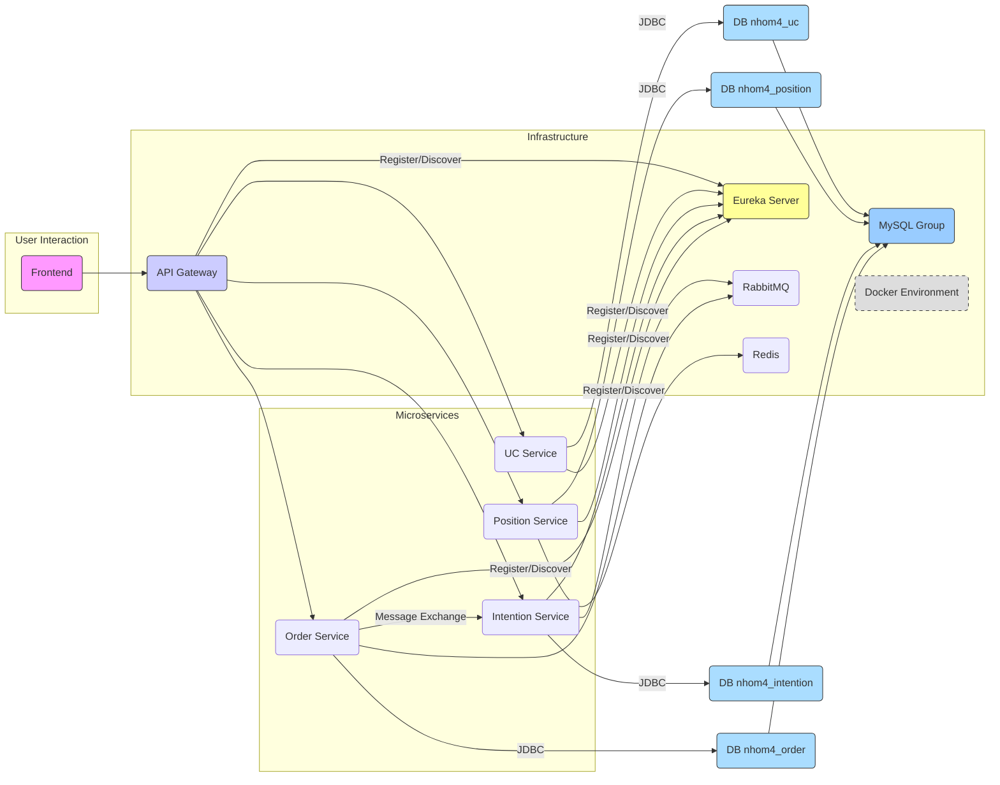

# 📊 Phân tích và Thiết kế Usecase Đặt Xe

## 1. 🎯 Mô tả bài toán
### Đặt vấn đề

- Hiện nay, các hệ thống giao thông công nghệ đã và đang phát triển nhanh chóng và trở thành một phần không thể thiếu trong cuộc sống. Do đó, nhóm 4 phát triển hệ thống giúp giải quyết bài toán tìm tài xế phù hợp cho khách hàng có nhu cầu đặt xe, quản lý toàn bộ quá trình từ khi đặt xe đến khi hoàn thành chuyến đi.
- Hệ thống có chức năng chính là:
    - Xử lý cập nhật vị trí của tài xế
    - Xử lý yêu cầu đặt xe của khách hàng
    - Tìm tài xế phù hợp với yêu cầu của khách hàng
    - Xử lý xác nhận chuyến đi từ khi khởi tạo đến khi đến nơi
### Người dùng chính của hệ thống
- **Khách hàng**: Đặt xe
- **Tài xế**: Cập nhật vị trí, xác nhận chuyến đi

### Mục tiêu chính
- Hỗ trợ khách hàng đưa ra ý định đặt xe theo mong muốn
- Kết nối khách hàng và tài xế phù hợp với vị trí
- Tối ưu quá trình ghép tài xế dựa trên vị trí
- Theo dõi toàn bộ quá trình chuyến đi từ khi đặt xe tới khi đến nơi

### Dữ liệu xử lý
- Thông tin người dùng (khách hàng, tài xế)
- Thông tin ý định đặt xe khách hàng (intention), các ứng viên tài xế phù hợp (candidate)
- Dữ liệu vị trí theo thời gian thực (position)
- Thông tin đơn đặt xe (order)

## 2. 🧩 Các Microservices

| Service | Chức năng | Công nghệ |
|---------|-----------|-----------|
| UC Service | Quản lý thông tin người dùng | Spring Boot, MySQL |
| Position Service | Cập nhật và theo dõi vị trí tài xế, tìm tài xế gần khách hàng | Spring Boot, Redis, MySQL |
| Intention Service | Xử lý yêu cầu đặt xe, tìm tài xế phù hợp | Spring Boot, MySQL, RabbitMQ |
| Order Service | Quản lý đơn đặt xe và cập nhật trạng thái chuyến đi | Spring Boot, MySQL, RabbitMQ |
| Eureka Server | Đăng ký và phát hiện dịch vụ | Spring Cloud Netflix Eureka |
| API Gateway | Điều hướng yêu cầu từ client đến services | Spring Cloud Gateway |

## 3. 🔄 Giao tiếp giữa các Service

- **API Gateway ⟷ Position Service**: REST API, cập nhật vị trí
- **API Gateway ⟷ Intention Service**: REST API, xử lý đặt xe
- **API Gateway ⟷ Order Service**: REST API, quản lý đơn hàng 
- **Order Service ⟷ User Service**: REST API, lấy thông tin người dùng
- **Position Service ⟷ User Service**: REST API, lấy thông tin người dùng
- **Intention Service ⟷ Position Service**: REST API, tìm tài xế gần khách hàng
- **Intention Service ⟷ User Service**: REST API, lấy thông tin người dùng
- **Intention Service → Order Service**: Giao tiếp bất đồng bộ qua RabbitMQ;
- **Service Discovery**: Tất cả services đăng ký với Eureka Server;

## 4. 🗂️ Thiết kế Dữ liệu

### UC Service
- **User**: Thông tin người dùng chung
    - id, userName, số điện thoại, type (Customer/Driver), địa chỉ
- **POI**: Thông tin điểm địa lý quan trọng (chưa hỗ trợ)
    - id, tên, số điện thoại, vị trí, loại địa điểm

### Position Service
- **Position**: Lịch sử vị trí của tài xế
    - tid, driverId, vị trí, thời gian, trạng thái
- **DriverStatus**: Trạng thái và vị trí hiện tại của tài xế
    - dId, thông tin tài xế, vị trí hiện tại, trạng thái, thời gian cập nhật

### Intention Service
- **Intention**: Yêu cầu đặt xe
    - mid, khách hàng, vị trí đón/trả, trạng thái, tài xế được chọn
- **Candidate**: Danh sách tài xế ứng viên cho mỗi yêu cầu
    - cid, intentionId, driverId, vị trí, thời gian

### Order Service
- **Order**: Đơn hàng
    - oid, thông tin khách hàng, thông tin tài xế, vị trí đón/trả, thời gian, trạng thái, intentionId

## 5. 🔐 Bảo mật

- Xác thực người dùng qua API Gateway
- Kiểm tra quyền truy cập dựa trên vai trò
- Xác thực API giữa các services

## 6. 📦 Kế hoạch Triển khai

- Sử dụng Docker và Docker Compose để đóng gói và quản lý các services
- Khởi tạo cơ sở dữ liệu tự động qua script
- Mỗi service có Dockerfile riêng

## 7. 🎨 Sơ đồ Luồng Đặt Xe

## ✅ Tổng kết

Kiến trúc microservices được chọn để đáp ứng các yêu cầu:
- **Khả năng mở rộng**: Mỗi service có thể mở rộng độc lập
- **Phát triển độc lập**: Các thành viên có thể làm việc đồng thời trên các service khác nhau
- **Khả năng chịu lỗi**: Lỗi ở một service không ảnh hưởng đến toàn bộ hệ thống
- **Công nghệ đa dạng**: Mỗi service có thể sử dụng công nghệ phù hợp nhất với chức năng

Hệ thống đảm bảo hiệu suất cao và trải nghiệm người dùng tốt thông qua việc sử dụng Redis cho dữ liệu thời gian thực và RabbitMQ cho giao tiếp bất đồng bộ.
