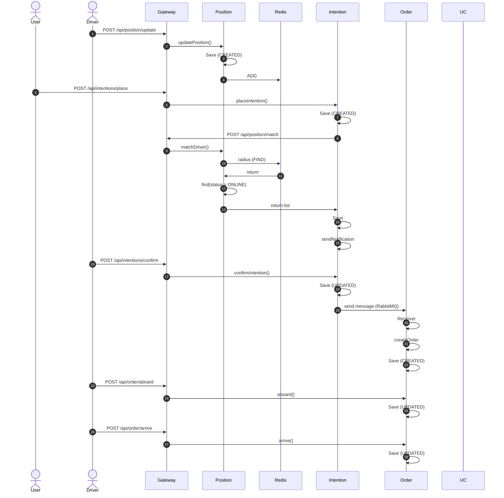
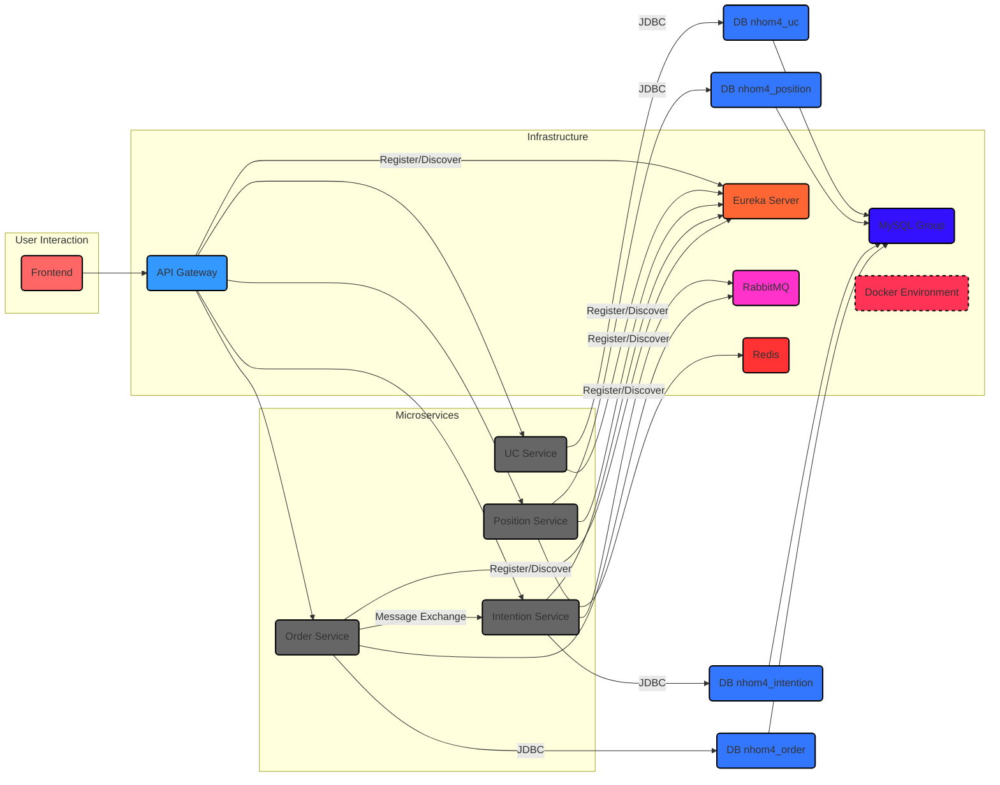

# Kiến trúc Hệ thống

## Tổng quan
- Use Case: đặt xe và quản lý chuyến xe được xây dựng với kiến trúc microservices.
- Use Case này được thiết kế để xử lý quá trình đặt xe của khách hàng và quản lý đơn đặt xe của khách.
- Kiến trúc hệ thống dựa trên **Microservices** cho phép các thành phần độc lập, dễ dàng bảo trì và mở rộng.
- Mục tiêu chính là mô phỏng quy trình đặt xe thực tế, từ lúc gửi yêu cầu đặt xe của khách hàng, xử lý để tìm kiếm các tài xế xung quanh tọa độ đặt xe, gửi đơn đặt xe tới các tài xế thỏa mãn điều kiện, cập nhật đơn đặt xe khi có tài xế xác nhận và cập nhật trạng thái của đơn đặt xe trong quá trình di chuyển từ điểm đón tới điểm trả khách, ngoài ra quá trình cập nhật vị trí của tài xế sẽ được thực hiện 1 cách liên tục.
- Các thành phần khác của hệ thống bao gồm **API Gateway** (Spring Cloud Gateway) làm cổng vào duy nhất, **Eureka** (Spring Cloud Netflix Eureka) cho Service Discovery, **Docker** để container hóa toàn bộ ứng dụng và hạ tầng (Redis, MySQL), và **MySQL** làm cơ sở dữ liệu với mô hình **database-per-service**.
<!-- - Các thành phần chính:
    - Các dịch vụ:
        - Service UC: Thành phần lưu trữ thông tin người dùng, có thể sử dụng để truy vấn dữ liệu người dùng.
        - Service Position: Thành phần sử dụng để cập nhật dữ liệu vị trí của tài xế vào CSDL và tìm kiếm tài xế xung quanh tọa độ đã cho.
        - Service Intention: Thành phần sử dụng để đặt xe với điểm xuất phát và điểm kết thúc xác định, và cập nhật đơn đặt xe khi có tài xế xác nhận.
        - Service Order: Thành phần lưu trữ đơn đặt xe, cập nhật trạng thái của đơn đặt xe, từ "Tài xế đi đến điểm đón", "Tài xế đón khách" tới "Tài xế trả khách"; ngoài ra người dùng có thể hủy chuyến xe trong 1 khoảng thời gian xác định.
    - API Gateway: Thành phần trung gian để điều hướng các dịch vụ.
    - Scripts: Thành phần khởi tạo CSDL.
    - Eureka Server: Thành phần quản lý dịch vụ.
- Cho phép mở rộng theo từng dịch vụ và phát triển độc lập.
- Dễ dàng triển khai, nâng cấp và bảo trì. -->

## Các thành phần hệ thống
Hệ thống bao gồm các microservices nghiệp vụ và các thành phần hạ tầng hỗ trợ:
1. **UC Service**: 
    * **Trách nhiệm**: Là một phần quan trọng của hệ thống, nơi các Service khác thường xuyên gọi tới. Quản lý toàn bộ thông tin của người dùng. Lưu trữ thông tin người dùng (`User` entity) vào database `nhom4_uc`.
    * **Logic chính**:
        * `UserRepository`: Xử lý lấy dữ liệu từ database một cách đơn giản thông qua khai báo `@RepositoryRestResource` mà không cần tạo 1 controller và service cụ thể.
        * Sử dụng `Type` enum để kiểm tra loại người dùng (Driver/User).
    * **Database**: `nhom4_uc` (MySQL) - Chứa bảng `t_user`.

2.  **Position Service**:
    * **Trách nhiệm**: Quản lý thông tin về lịch sử vị trí của tài xế (`Position` entity) và thông tin trạng thái của tài xế (`DriverStatus` entity). Cung cấp API (`PositionController`) để FE hoặc các Service khác có thể truy vấn thông tin vị trí của tài xế. 
    * **Logic chính**:
        * `PositionService`: 
            * Thực hiện logic `updatePosition` với 3 tham số đầu vào là `DriverId`, `longitude` và `latitude` để cập nhật vị trí của tài xế vào database (`t_position` table), đồng thời cập nhật trạng thái mới nhất đó vào database (`t_driver_status` table) và cập nhật tọa độ vị trí, `driverId` cùng 1 key `Driver` vào Redis, sau đó trả về `driverStatus` vừa cập nhật đó.
            * Thực hiện logic `matchDriver` với 2 tham số đầu vào là `longitude` và `latitude` để tìm kiếm tài xế đang ở chung quanh tọa độ nhận được, lọc chỉ để lại các tài xế có trạng thái `ONLINE` và gửi danh sách tài xế đó.
        * Sử dụng `Status` enum để theo dõi trạng thái tài xế (ONLINE/OFFLINE/BUSY).
    * **Database**: `nhom4_position` (MySQL) - Chứa bảng `t_position` và `t_driver_status`.

3.  **Intention Service**:
    * **Trách nhiệm**: Quản lý thông tin về yêu cầu đặt xe của khách hàng (`Intention` entity). Cung cấp API (`IntentionController`) để FE của người dùng có thể thực hiện đặt xe (Khách hàng) và xác nhận đón khách (Tài xế). 
    * **Logic chính**:
        * `IntentionService`: 
            * Thực hiện logic `placeIntention` để yêu cầu đặt xe, cập nhật yêu cầu đặt xe vào database (`intention_intention` table) và cho vào hàng đợi.
            * Thực hiện logic `fromDriverStatus` để gọi API tới `PositionService` để lấy thông tin các tài xế hợp lệ.
            * Thực hiện logic `sendNotification` để gửi yêu cầu đặt xe cho các tài xế thỏa mãn điều kiện sau khi thực hiện `matchDriver` của `PositionService`.
            * Thực hiện logic `confirmIntention` để xác nhận tài xế, cập nhật yêu cầu đặt xe vào database (`intention_intention` table), gửi dữ liệu về yêu cầu đặt xe cho `OrderService` cùng với đối tượng tài xế hợp lệ `DriverVO`.
    * **Database**: `nhom4_intention` (MySQL) - Chứa bảng `intention_intention` và `intention_candidate`.

4.  **Order Service**:
    * **Trách nhiệm**: Quản lý đơn đặt xe của khách hàng (`Order` entity). Cung cấp API (`OrderController`) để FE của người dùng có thể thực hiện cập nhật trạng thái của đơn (Tài xế) và hủy đặt xe (Khách hàng). 
    * **Logic chính**:
        * `Receiver`:
            * Thực hiện logic `receiveMessage` để nhận dữ liệu từ `IntentionService` và gọi tới `createOrder` để khởi tạo đơn đặt xe.
        * `OrderService`: 
            * Thực hiện logic `createOrder` để tìm kiếm thông tin khách hàng và tài xế thông qua gọi API tới `UC Service` và khởi tạo thông tin đơn đặt xe vào database (`t_order` table) và trả về thông tin đơn đặt xe đã tạo.
            * Thực hiện logic `aboard` để cập nhật trạng thái của đơn đặt xe thành `WAITING_ARRIVE` (Đã đến đón khách) và lưu lại vào database.
            * Thực hiện logic `arrive` để cập nhật trạng thái của đơn đặt xe thành `UNPAY` (Đã đến điểm trả khách) và lưu lại vào database.
            * Thực hiện logic `cancel` để hủy đơn đặt xe từ phía khách hàng trong vòng 3 phút sau khi có tài xế xác nhận đón, đồng thời cập nhật trạng thái của đơn đặt xe thành `canceled` (Đã hủy) và lưu lại vào database.
        * Sử dụng `FlowState` enum để cập nhật trạng thái đơn đặt xe.
    * **Database**: `nhom4_order` (MySQL) - Chứa bảng `t_order`.

5.  **API Gateway**:
    * **Trách nhiệm**: Là điểm vào (entry point) duy nhất cho các yêu cầu từ Frontend (FE). Thực hiện điều hướng (routing) các request đến các microservices tương ứng dựa trên đường dẫn (path). Sử dụng **load balancing** (thông qua `lb://` prefix) và **service discovery** (Eureka) để tìm đến các instance service khỏe mạnh.
    * **Công nghệ**: Spring Cloud Gateway. Cấu hình routes trong `application.yml`. Tích hợp với Eureka Client.

6.  **Eureka Server**:
    * **Trách nhiệm**: Service Discovery registry. Các microservices (bao gồm cả `API Gateway`) đăng ký thông tin (IP, port) của mình lên Eureka khi khởi động. Khi một service cần gọi service khác, nó sẽ truy vấn Eureka để lấy địa chỉ của service đích.
    * **Công nghệ**: Spring Cloud Netflix Eureka Server.

7. **Redis**:
    * **Trách nhiệm**: Lưu trữ dữ liệu tạm thời **(in-memory)** để hỗ trợ truy vấn nhanh và quản lý trạng thái thời gian thực. Trong hệ thống, Redis được sử dụng bởi **Position Service** để lưu trữ tọa độ vị trí của tài xế (dựa trên `longitude` và `latitude`) cùng với key `Driver` để hỗ trợ tìm kiếm tài xế nhanh chóng trong quá trình xử lý yêu cầu đặt xe. Redis đảm bảo hiệu suất cao cho các tác vụ yêu cầu truy cập dữ liệu thường xuyên và có tính chất tạm thời.
    * **Cấu hình**: 
        * Redis được triển khai như một container độc lập thông qua `docker-compose.yml`, sử dụng image Redis chính thức.
        * Các microservices (như **Position Service**) kết nối đến Redis thông qua cấu hình trong `application.yaml` hoặc `application.properties`

8. **mysql**:
    * **Trách nhiệm**: Hệ quản trị cơ sở dữ liệu quan hệ, lưu trữ dữ liệu bền vững cho các microservices. Mỗi service có một database riêng biệt theo pattern **Database-per-service**, đảm bảo tính độc lập về dữ liệu.
    * **Cấu hình**: Script `init-db.sql` tạo các database riêng. Các service kết nối tới database của mình thông qua cấu hình trong `application.yaml` hoặc `application.properties`.

9. **docker**:
    * **Trách nhiệm**: Công cụ container hóa, đóng gói từng microservice và thành phần hạ tầng (Redis, MySQL, Eureka, Gateway) thành các container độc lập. `docker-compose.yml` được cung cấp để khởi tạo môi trường hạ tầng cơ bản (Redis, MySQL). Các service có `Dockerfile` riêng (ví dụ: `gateway/Dockerfile`, `services/order/Dockerfile`) để build image.

## Giao tiếp
Giao tiếp trong hệ thống diễn ra qua các kênh chính:
1.  **Frontend (FE) -> Backend (BE)**:
    * FE gửi request HTTP (REST API) đến **API Gateway**.
    * Các request như cập nhật vị trí tài xế, khách hàng đặt xe (`/api/intentions/place`) sẽ được Gateway điều hướng đến service tương ứng.

2.  **Service-to-Service**:
    * Các dịch vụ giao tiếp trực tiếp với nhau thông qua **REST API** (Có sự điều hướng trung gian của **API Gateway**).
    * Riêng giao tiếp giữa **Intention Service** và **Order Service** sử dụng thông qua **RabbitMQ**.
    
3.  **Service Discovery**:
    * Tất cả các microservices (bao gồm cả Gateway) đăng ký với **Eureka Server** khi khởi động.
    * Khi cần giao tiếp (ví dụ: Gateway định tuyến `lb://ORDER-SERVICE`, hoặc một service gọi service khác, chúng truy vấn Eureka Server để lấy địa chỉ IP và port của instance service đích đang hoạt động.

## Luồng dữ liệu
Luồng dữ liệu chính của use case đặt xe được thực hiện như sau:

**Luồng chính (Main Path):**

0.  **Cập nhật vị trí tài xế**:
    * Request `POST /api/position/update` (với RequestParam `driverId`, `longitude`, `latitude`) đến Gateway -> `PositionService`.
    * `PositionService.updatePosition`: Lưu `Position` và cập nhật `DriverStatus` vào database (`nhom4_position`), sau đó lưu tọa độ, `driverId` cùng key là **Driver** `Redis`.
    * Nếu chưa có `DriverStatus` trong database từ trước sẽ gọi Request `GET UC-SERVICE/users/` cùng với `id` của Driver để lấy `Driver`.

1.  **Tạo yêu cầu đặt xe**:
    * FE gửi request `POST /api/intentions/place` (chứa `userId`, `startLongitude`, `startLatitude`, `destLongitude`, `destLatitude`) đến Gateway -> `IntentionService`.
    * `IntentionService.placeIntention`: Lưu `Intention` vào database (`nhom4_intention`), status = `Inited` và đưa `Intention` vào hàng đợi.

2. **BE xử lý**:
    * `IntentionService` gửi request `POST /api/position/match` (chứa `longitude`, `latitude`) đến Gateway -> `PositionService`.
    * `PositionService.matchDriver`: Tạo một hình tròn bán kính xác định và tìm kiếm thông qua Redis để lấy danh sách tài xế có tọa độ nằm trong bán kính này. Thực hiện lọc để trả về cho `IntentionService` danh sách tài xế với status = `ONLINE`.
    * `IntentionService`: Nhận danh sách tài xế hợp lệ, lưu vào database (`intention_candidate` table).

3. **Gửi thông báo cho tài xế**:
    * `IntentionService.sendNotification`: Gửi yêu cầu đặt xe của khách hàng tới tất cả tài xế nhận được từ `PositionService`.

4. **Tài xế xác nhận**:
    * FE gửi request `POST /api/intentions/confirm` (chứa `driverId`, `intentionId`) đến Gateway -> `IntentionService`.
    * `IntentionService.confirmIntention`: Lưu lại yêu cầu đặt xe vào database (`intention_intention` table) và gửi yêu cầu đặt xe tới `OrderService`thông qua RabbitMQ.

5. **Khởi tạo đơn đặt xe**:
    * `Receiver` của **Order Service** nhận gói tin từ **Intention Service** thông qua RabbitMQ và gọi `createOrder`.
    * `OrderService.createOrder`: Khởi tạo đơn đặt xe của khách hàng và lưu vào database (`t_order` table) với status = `WAITING_ABOARD`.

6. **Khi tài xế đến vị trí đón khách**:
    * FE gửi request `POST /api/order/aboard` (chứa `orderId`) đến Gateway -> `OrderService`.
    * `OrderService.aboard`: Cập nhật lại đơn đặt xe của khách hàng vào database với state = `WAITING_ARRIVE`.

7. **Khi tài xế đến vị trí trả khách**:
    * FE gửi request `POST /api/order/arrive` (chứa `orderId`) đến Gateway -> `OrderService`.
    * `OrderService.arrive`: Cập nhật lại đơn đặt xe của khách hàng vào database với state = `UNPAY`.

**Luồng ngoại lệ (Exception Path):**

1. **Tọa độ điền vào sai**:
    * Request `POST /api/position/update` (với RequestParam `driverId`, `longitude`, `latitude`) hoặc `POST /api/position/match` (chứa `longitude`, `latitude`) có (`longitude` > 180 hoặc < -180) hoặc (`latitude` > 90 hoặc < -90).
    * **Position Service** sẽ trả về message `Tọa độ không hợp lệ`.

2. **Không có tài xế xung quanh khu vực của khách hàng**:
    * **Intention Service** sau khi nhận được danh sách tài xế là `null` từ **Position Service** sẽ cập nhật lại `Intention` với status = `Failed` và trả về `false`.

3. **Khách hàng hủy chuyến**:
    * FE gửi request `POST /api/order/cancel` (chứa `orderId`) đến Gateway -> `OrderService`.
    * `OrderService.cancel`: Cập nhật lại đơn đặt xe của khách hàng vào database với state = `CANCELED`.

## Sơ đồ

Sơ đồ nên minh họa các thành phần sau và luồng tương tác chính:
-   Client (FE) gồm User và Driver
-   API Gateway
-   Eureka Server
-   RabbitMQ
-   Các Microservices (`UCService`, `PositionService`, `OrderService`, `IntentionService`)
-   MySQL Databases (riêng cho từng service)
-   Luồng gọi từ FE -> Gateway -> Services.
-   Luồng gửi dữ liệu từ `IntentionService` tới `OrderService` thông qua `RabbitMQ`
-   Luồng đăng ký và khám phá dịch vụ qua Eureka.

## Khả năng mở rộng và chịu lỗi
1. Kiểm tra ngoại lệ để tránh lỗi
- Mỗi service đều có kiểm tra dữ liệu trước khi xử lý
- Position service kiểm tra các tọa độ địa lý hợp lệ
### 2. Sử dụng Circuit Breaker và các logic tương đương để xử lý khi gặp lỗi
- Ở các hàm truy vấn dữ liệu sử dụng Circuit Breaker để gọi các hàm fallback nếu có vấn đề xảy ra trong quá trình thực hiện logic, đảm bảo hệ thống vẫn hoạt động, không bị dừng
### 3. RabbitMQ
- **Độ bền**: RabbitMQ lưu trữ message trên đĩa và hỗ trợ replication giữa các broker. Điều này đảm bảo message không bị mất ngay cả khi một service consumer tạm thời bị lỗi.
- **Bộ đệm**: Nếu một service consumer (ví dụ: order-service) bị quá tải hoặc gặp lỗi tạm thời, các message yêu cầu vẫn được lưu trữ an toàn trong queue. Khi service đó hoạt động trở lại hoặc có instance khác xử lý, nó có thể tiếp tục xử lý các message tồn đọng.
### 4. Service Discovery (Eureka): 
- Nếu một instance của microservice nào đó bị lỗi, Eureka Server sẽ phát hiện (thông qua heartbeat) và loại bỏ nó khỏi danh sách đăng ký. API Gateway và các service khác khi truy vấn Eureka sẽ chỉ nhận được địa chỉ của các instance khỏe mạnh, giúp hệ thống định tuyến request vòng qua các instance lỗi và tiếp tục hoạt động.
