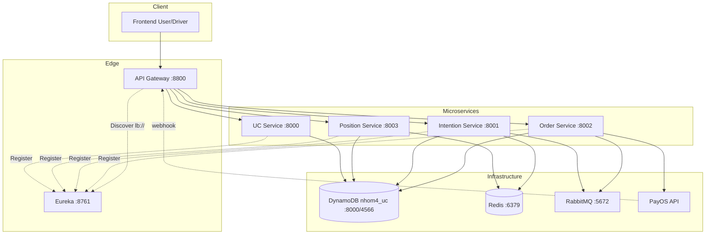
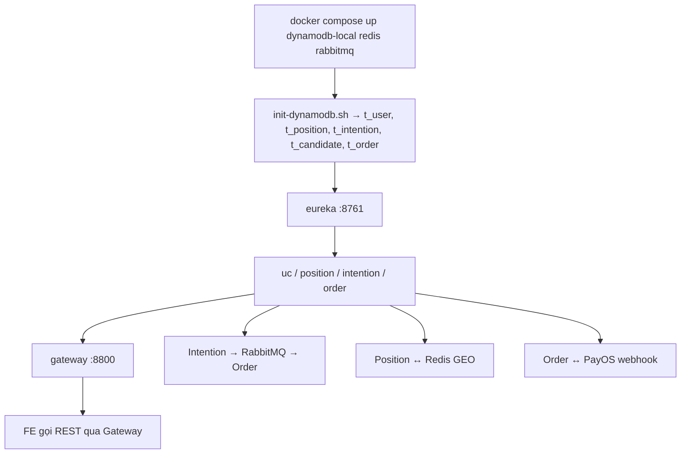

# Tài liệu Thiết kế Cấu hình & Triển khai Local — Hệ thống Đặt Xe HDV

Tài liệu mô tả **các project Java Spring Boot**, **cấu hình YAML/Properties**, **Docker Compose**, **DynamoDB**, **PayOS** và cách chạy local. Bám theo `thiet_ke_sequence.md` và `thiet_ke_database.md`.

---

## 1. Tổng quan

| Lớp | Công nghệ local |
|---|---|
| Ứng dụng | Spring Boot microservices (Gradle, Java 21, từng module độc lập) |
| Cấu hình | `application.yml` / `application.properties` + biến môi trường Docker |
| Service Discovery | **Eureka Server** (`8761`) |
| API Gateway | **Spring Cloud Gateway** (`8800`) |
| Messaging | **RabbitMQ** (AMQP `5672`, Management UI `15672`) |
| Cache / GEO / Lock | **Redis 7** (`6379`) |
| Database | **DynamoDB** — database logic **`nhom4_uc`** (5 bảng) |
| Thanh toán | **PayOS** (cấu hình chi tiết bổ sung sau) |
| Quan sát | Spring Boot Actuator (`/actuator/health`) |

### 1.1 Sơ đồ phụ thuộc runtime



---

## 2. Các project Java

### 2.1 Danh sách project

| # | Project | Port | Vai trò |
|---|---|---|---|
| 1 | **eureka** | `8761` | Service Discovery |
| 2 | **gateway** | `8800` | API Gateway + JWT |
| 3 | **nhom4-user** | `8000` | Quản lý User (`t_user`) |
| 4 | **nhom4-position** | `8003` | Vị trí (`t_position`) + Redis GEO |
| 5 | **nhom4-intention** | `8001` | Đặt xe (`t_intention`, `t_candidate`) |
| 6 | **nhom4-order** | `8002` | Đơn hàng (`t_order`) + PayOS |

### 2.2 Phạm vi từng project

**nhom4-user**

- Spring Data REST `/users`
- DynamoDB table **`t_user`**

**nhom4-position**

- `PositionController` `/api/position`
- DynamoDB **`t_position`** + Redis GEO key **`Driver`**

**nhom4-intention**

- `IntentionController` `/api/intentions`
- DynamoDB **`t_intention`**, **`t_candidate`**
- Redis lock **`nhom4.lock.intention{id}`** khi confirm
- RabbitMQ producer queue **`intention`**
- Resilience4j Circuit Breaker

**nhom4-order**

- `OrderController` `/api/order`
- `Receiver` `@RabbitListener(queues = "intention")`
- DynamoDB **`t_order`**
- PayOS: tạo payment link + webhook handler

### 2.3 Stack kỹ thuật

| Hạng mục | Giá trị |
|---|---|
| Java | **21** / Spring Boot 3.4.x |
| Build | **Gradle** (Wrapper 9.1.x) — `./gradlew bootJar` |
| Framework | Spring Boot, Spring Cloud Gateway, Netflix Eureka |
| Persistence | **AWS SDK v2 DynamoDB** (Enhanced Client) |
| Messaging | Spring AMQP (RabbitMQ) |
| Cache / Lock | Spring Data Redis |
| Payment | PayOS REST API |
| Observability | Spring Boot Actuator |

---

## 3. Cấu hình DynamoDB

### 3.1 Nguyên tắc

- Tất cả bảng nằm trong logical database **`nhom4_uc`**.
- Local dev: **DynamoDB Local** hoặc **Floci** (`http://localhost:4566`).
- Mỗi service truy cập các bảng cần thiết qua AWS SDK; không dùng MySQL.

### 3.2 Bảng trong `nhom4_uc`

| Bảng | PK | SK | GSI |
|---|---|---|---|
| `t_user` | `id` | — | — |
| `t_position` | `driver_id` | `upload_time` | `tid-index` |
| `t_intention` | `mid` | — | `idempotency-key-index`, `customer-id-index` |
| `t_candidate` | `intention_id` | `driver_id` | — |
| `t_order` | `oid` | — | `intention-id-index`, `customer-id-index` |

Chi tiết schema: `thiet_ke_database.md`.

### 3.3 Cấu hình SDK (ví dụ — Intention Service)

```yaml
hdv:
  dynamodb:
    region: ${AWS_REGION:ap-southeast-1}
    endpoint-url: ${AWS_ENDPOINT_URL:http://localhost:4566}
    tables:
      user: t_user
      intention: t_intention
      candidate: t_candidate

spring:
  data:
    redis:
      host: ${SPRING_REDIS_HOST:localhost}
      port: 6379
      database: 2
```

### 3.4 Biến môi trường DynamoDB

| Biến | Local (host) | Docker Compose |
|---|---|---|
| `AWS_ENDPOINT_URL` | `http://localhost:4566` | `http://dynamodb-local:4566` |
| `AWS_REGION` | `ap-southeast-1` | `ap-southeast-1` |
| `AWS_ACCESS_KEY_ID` | `test` | `test` |
| `AWS_SECRET_ACCESS_KEY` | `test` | `test` |

### 3.5 Init script (đề xuất)

Script tạo bảng trong `scripts/init-dynamodb.sh` hoặc `docker/dynamodb/init/`:

```bash
aws --endpoint-url http://localhost:4566 dynamodb create-table \
  --table-name t_intention \
  --attribute-definitions \
    AttributeName=mid,AttributeType=N \
    AttributeName=idempotency_key,AttributeType=S \
  --key-schema AttributeName=mid,KeyType=HASH \
  --global-secondary-indexes '...'
```

> Các bảng còn lại tương tự — xem key schema trong `thiet_ke_database.md`.

---

## 4. Cấu hình Redis

### 4.1 Key theo luồng

| Key | Kiểu | Service | Luồng | Mục đích |
|---|---|---|---|---|
| `Driver` | GEO | Position | §1 Update, §2 Match | GEORADIUS 500m |
| `nhom4.lock.intention{id}` | STRING | Intention | §3 Confirm | Distributed lock |

> **Idempotency-Key** lưu trên DynamoDB `t_intention.idempotency_key` — **không** dùng Redis.

### 4.2 Properties

```properties
spring.data.redis.host=localhost
spring.data.redis.port=6379
spring.data.redis.database=2
spring.data.redis.timeout=2000ms
```

Docker override: `SPRING_REDIS_HOST=redis`.

---

## 5. Cấu hình PayOS

> Thông tin chi tiết PayOS (Client ID, API Key, Checksum Key, webhook URL) **sẽ cung cấp sau**. Phần dưới là placeholder cấu hình.

### 5.1 Biến môi trường (placeholder)

| Biến | Mô tả |
|---|---|
| `PAYOS_CLIENT_ID` | Client ID từ PayOS dashboard |
| `PAYOS_API_KEY` | API Key |
| `PAYOS_CHECKSUM_KEY` | Key verify webhook signature |
| `PAYOS_RETURN_URL` | URL redirect sau thanh toán thành công |
| `PAYOS_CANCEL_URL` | URL khi user hủy thanh toán |
| `PAYOS_WEBHOOK_URL` | `https://{gateway}/api/order/payos/webhook` |

### 5.2 Cấu hình Order Service (placeholder)

```yaml
payos:
  client-id: ${PAYOS_CLIENT_ID:}
  api-key: ${PAYOS_API_KEY:}
  checksum-key: ${PAYOS_CHECKSUM_KEY:}
  return-url: ${PAYOS_RETURN_URL:http://localhost:3000/payment/success}
  cancel-url: ${PAYOS_CANCEL_URL:http://localhost:3000/payment/cancel}
  webhook-url: ${PAYOS_WEBHOOK_URL:http://localhost:8800/api/order/payos/webhook}
```

### 5.3 Pricing đơn giản

```yaml
hdv:
  pricing:
    fixed-fare: 50000        # VND — một giá cố định
    currency: VND
```

Giá được snapshot vào `t_intention.price` lúc place, copy sang `t_order.price` khi tạo đơn. PayOS charge đúng `price` này.

---

## 6. Cấu hình YAML / Properties (các service)

### 6.1 Eureka

```properties
server.port=8761
eureka.instance.hostname=discovery
eureka.client.registerWithEureka=false
eureka.client.fetchRegistry=false
```

### 6.2 Gateway — routes

```yaml
spring:
  cloud:
    gateway:
      routes:
        - id: uc-service
          uri: lb://UC-SERVICE
          predicates:
            - Path=/users/**
        - id: position-service
          uri: lb://POSITION-SERVICE
          predicates:
            - Path=/api/position/**
        - id: intention-service
          uri: lb://INTENTION-SERVICE
          predicates:
            - Path=/api/intentions/**
        - id: order-service
          uri: lb://ORDER-SERVICE
          predicates:
            - Path=/api/order/**

server:
  port: 8800
```

### 6.3 Intention Service

```properties
server.port=8001
spring.application.name=intention-service
spring.rabbitmq.host=localhost
spring.rabbitmq.port=5672
spring.data.redis.host=localhost
spring.data.redis.database=2
hdv.dynamodb.endpoint-url=http://localhost:4566
hdv.pricing.fixed-fare=50000
```

Queue bean: **`intention`**.

### 6.4 Order Service

```yaml
server:
  port: 8002
spring:
  application:
    name: order-service
  rabbitmq:
    host: localhost
    port: 5672
hdv:
  dynamodb:
    endpoint-url: http://localhost:4566
payos:
  client-id: ${PAYOS_CLIENT_ID:}
  api-key: ${PAYOS_API_KEY:}
```

### 6.5 Tên service trên Eureka (Docker)

| `SPRING_APPLICATION_NAME` | Gateway URI |
|---|---|
| `UC-SERVICE` | `lb://UC-SERVICE` |
| `POSITION-SERVICE` | `lb://POSITION-SERVICE` |
| `INTENTION-SERVICE` | `lb://INTENTION-SERVICE` |
| `ORDER-SERVICE` | `lb://ORDER-SERVICE` |

---

## 7. Cấu trúc repo

```
HDV/
  build.gradle
  gradle.properties
  settings.gradle
  gradlew / gradlew.bat
  gradle/wrapper/
  Dockerfile                 # Gradle services (SERVICE_NAME)
  docker-compose.yml
  .env.example
  scripts/
  eureka/                       # Maven (discovery)
  gateway/                      # Maven (API Gateway)
  nhom4-user/build.gradle       # Java 21
  nhom4-position/build.gradle
  nhom4-intention/build.gradle
  nhom4-order/build.gradle
  docs/
```

---

## 8. Hạ tầng local — cổng & credential

### 8.1 Bảng cổng

| Service | Host port |
|---|---|
| DynamoDB Local / Floci | `4566` |
| Redis | `6379` |
| Redis Commander | `8081` |
| RabbitMQ AMQP | `5672` |
| RabbitMQ Management | `15672` |
| Eureka | `8761` |
| Gateway | `8800` / `8801` |
| UC | `8000` / `8011` |
| Intention | `8001` / `8013` |
| Order | `8002` / `8014` |
| Position | `8003` / `8012` |

### 8.2 Credential mặc định (dev)

| Thành phần | User / Pass |
|---|---|
| DynamoDB Local | `test` / `test` (fake credential) |
| RabbitMQ | `guest` / `guest` |
| PayOS | _(cung cấp sau)_ |

---

## 9. Docker Compose (thiết kế mục tiêu)

> Compose hiện tại trong repo vẫn dùng MySQL — khi migrate sang DynamoDB, thay `mysql` service bằng DynamoDB Local.

### 9.1 Thành phần mục tiêu

| Service | Image / Build | Ghi chú |
|---|---|---|
| `dynamodb-local` | `amazon/dynamodb-local` hoặc Floci | Port `4566`, init tables |
| `redis` | `redis:7-alpine` | GEO + lock |
| `redis-commander` | rediscommander | UI Redis |
| `rabbitmq` | `rabbitmq:3-management` | Queue `intention` |
| `eureka` | build `./eureka` | Discovery |
| `uc-service-1/2` | build `./nhom4-user` | DynamoDB `t_user` |
| `position-service-1/2` | build `./nhom4-position` | `t_position` + Redis |
| `intention-service-1/2` | build `./nhom4-intention` | `t_intention`, `t_candidate` |
| `order-service-1/2` | build `./nhom4-order` | `t_order` + PayOS |
| `gateway-1/2` | build `./gateway` | Entry point |

### 9.2 Ví dụ env override (Intention Service)

```yaml
environment:
  AWS_ENDPOINT_URL: http://dynamodb-local:4566
  AWS_REGION: ap-southeast-1
  AWS_ACCESS_KEY_ID: test
  AWS_SECRET_ACCESS_KEY: test
  SPRING_REDIS_HOST: redis
  SPRING_RABBITMQ_HOST: rabbitmq
  EUREKA_CLIENT_SERVICEURL_DEFAULTZONE: http://eureka:8761/eureka/
  SPRING_APPLICATION_NAME: INTENTION-SERVICE
  HDV_PRICING_FIXED_FARE: 50000
```

### 9.3 Ví dụ env override (Order Service — PayOS)

```yaml
environment:
  AWS_ENDPOINT_URL: http://dynamodb-local:4566
  PAYOS_CLIENT_ID: ${PAYOS_CLIENT_ID}
  PAYOS_API_KEY: ${PAYOS_API_KEY}
  PAYOS_CHECKSUM_KEY: ${PAYOS_CHECKSUM_KEY}
  PAYOS_WEBHOOK_URL: http://gateway:8800/api/order/payos/webhook
```

### 9.4 Khởi động & kiểm tra

```bash
docker compose up --build -d

# DynamoDB — list tables
aws --endpoint-url http://localhost:4566 dynamodb list-tables

# Redis
redis-cli -h localhost ping

# Gateway health
curl http://localhost:8800/actuator/health
```

### 9.5 Tài nguyên init

**DynamoDB** (`thiet_ke_database.md`) — database **`nhom4_uc`**:

| Bảng | PK | GSI |
|---|---|---|
| `t_user` | `id` | — |
| `t_position` | `driver_id` + `upload_time` | `tid-index` |
| `t_intention` | `mid` | `idempotency-key-index`, `customer-id-index` |
| `t_candidate` | `intention_id` + `driver_id` | — |
| `t_order` | `oid` | `intention-id-index`, `customer-id-index` |

**RabbitMQ**:

| Queue | Producer | Consumer |
|---|---|---|
| `intention` | Intention Service | Order Service |

**Redis** (`thiet_ke_sequence.md` §7):

| Key | Luồng |
|---|---|
| `Driver` (GEO) | §1 Update, §2 Match |
| `nhom4.lock.intention{id}` | §3 Confirm |

---

## 10. Build local (Gradle + Java 21)

Bốn service nghiệp vụ thuộc **một Gradle multi-project** ở root (Java 21). Mỗi service chỉ có `build.gradle`:

```bash
./gradlew :nhom4-user:bootJar -x test
./gradlew :nhom4-position:bootJar -x test
./gradlew :nhom4-intention:bootJar -x test
./gradlew :nhom4-order:bootJar -x test
# hoặc tất cả:
./gradlew bootJar -x test
```

IDE: mở root `HDV`, chạy main class của từng module (`UCApplication`, `PositionApplication`, …).

Docker Compose dùng **một** `Dockerfile` ở root, truyền `SERVICE_NAME` / `SERVICE_PORT` (build arg) rồi gọi `./gradlew :<module>:bootJar`.

`eureka` và `gateway` vẫn dùng Maven.

---

## 11. Thứ tự chạy local



1. DynamoDB Local (+ init tables), Redis, RabbitMQ.
2. Eureka Server.
3. UC → Position → Intention → Order.
4. API Gateway.
5. Cấu hình PayOS (khi có credential).
6. Kiểm thử luồng theo `thiet_ke_sequence.md`.

---

## 12. Kiểm thử tích hợp

| Cách | Ghi chú |
|---|---|
| **E2E qua Gateway** | Place → Match → Confirm → Order aboard/arrive → Pay |
| **Idempotency** | Gửi 2 lần cùng `Idempotency-Key` → cùng `mid` trên `t_intention` |
| **Race confirm** | 3 driver confirm cùng lúc → 1 Assigned, 2 × 409 |
| **RabbitMQ UI** | Queue `intention` có message khi confirm |
| **Redis Commander** | GEO members key `Driver`; lock key khi confirm |
| **PayOS sandbox** | Tạo link → webhook → `t_order` status = PAID |

Checklist API:

| API | Method | Path |
|---|---|---|
| Cập nhật vị trí | POST | `/api/position/update` |
| Match tài xế | GET | `/api/position/match` |
| Đặt xe | POST | `/api/intentions/place` (+ `Idempotency-Key`) |
| Confirm | POST | `/api/intentions/confirm` |
| Aboard / Arrive | POST | `/api/order/aboard` · `/arrive` |
| Thanh toán PayOS | POST | `/api/order/pay` |
| Webhook PayOS | POST | `/api/order/payos/webhook` |
| Hủy | POST | `/api/order/cancel` |

---

## 13. Liên kết tài liệu

| Tài liệu | Nội dung |
|---|---|
| `thiet_ke_sequence.md` | Luồng REST, Redis keys, PayOS, Idempotency |
| `thiet_ke_database.md` | Schema DynamoDB `nhom4_uc` |
| `architecture.md` | Tổng quan kiến trúc |
| `docker-compose.yml` | Orchestration (đang migrate MySQL → DynamoDB) |

---

## 14. Ghi chú migration

| Hạng mục | Trạng thái |
|---|---|
| Database | Thiết kế mới: **DynamoDB `nhom4_uc`** — gom 5 bảng, bỏ `tb_poi`, `t_driver_status` |
| Tên bảng | `t_intention`, `t_candidate`, `t_order` (thay tên cũ) |
| Idempotency | Lưu `idempotency_key` trên `t_intention` (GSI), không Redis |
| Pricing | Một giá cố định (`fixed-fare`), snapshot lúc place |
| Thanh toán | PayOS — credential bổ sung sau |
| Code hiện tại | Vẫn dùng MySQL/JPA — cần migrate sang AWS SDK DynamoDB theo tài liệu này |
| Docker Compose | Vẫn mount `init-db.sql` (MySQL) — thay bằng DynamoDB Local + `init-dynamodb.sh` khi triển khai |
