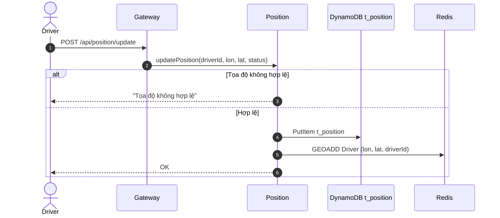
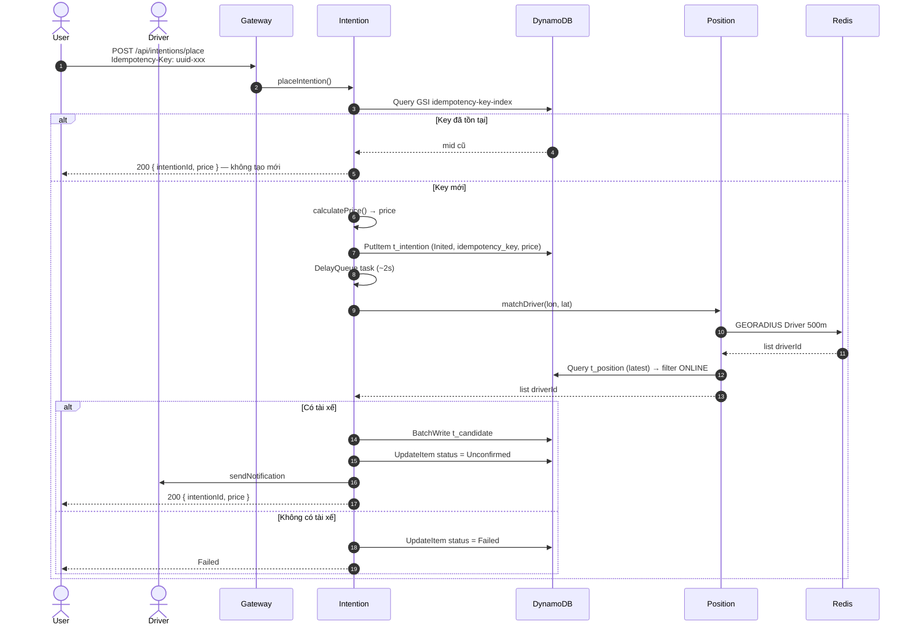
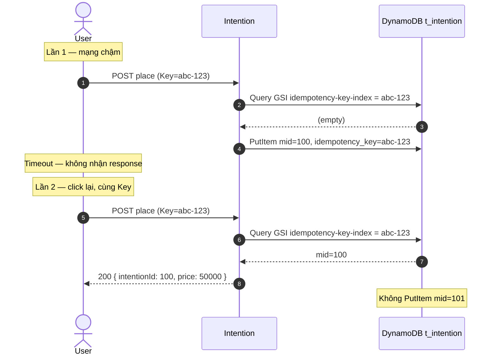
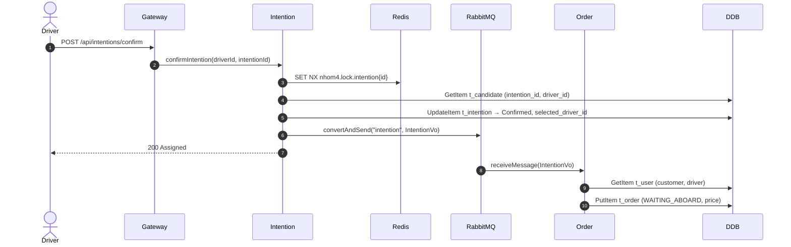
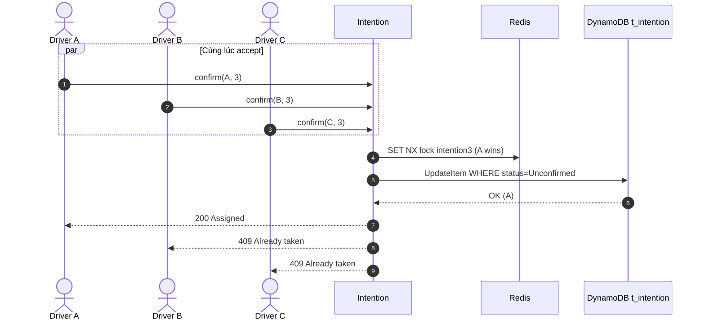
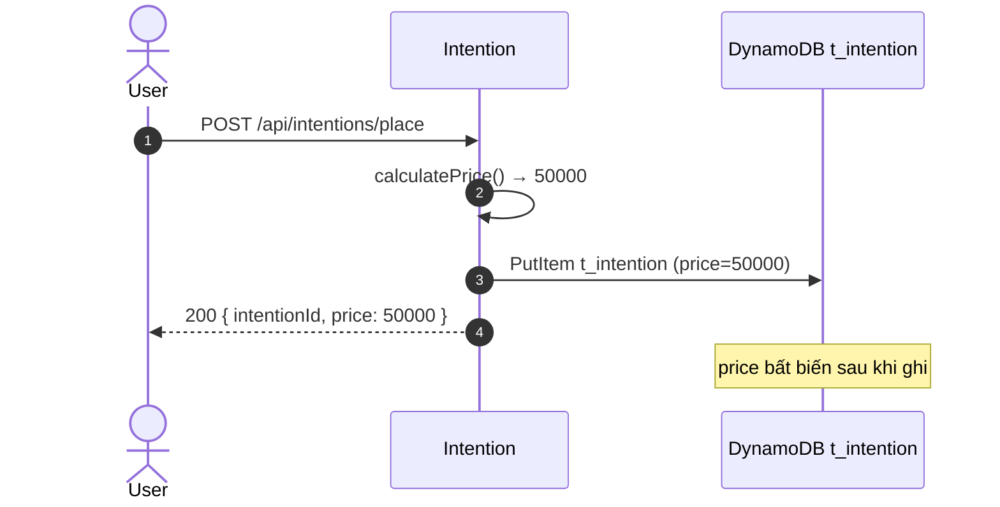
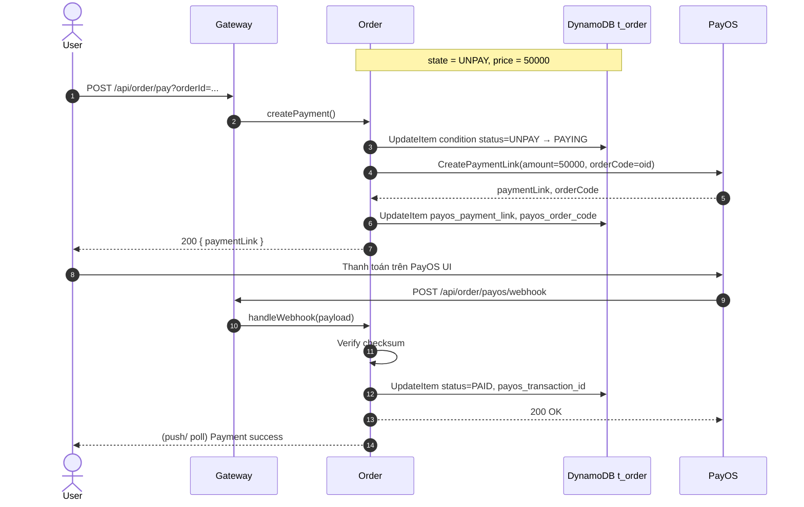
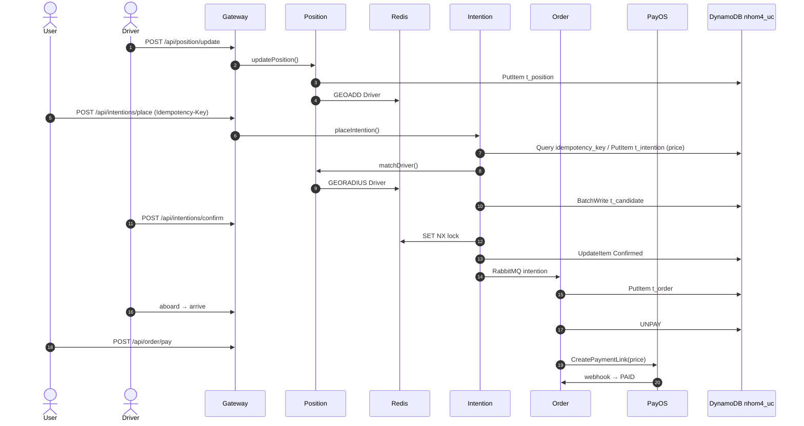

# Tài liệu Luồng Xử lý Đặt Xe — Hệ thống Microservices HDV

Tài liệu mô tả chi tiết các luồng thông tin chính trong hệ thống đặt xe và quản lý chuyến đi:

- **API Gateway**: cổng vào duy nhất từ Frontend (REST), định tuyến qua Eureka (`lb://`).
- **Position Service**: cập nhật vị trí tài xế (DynamoDB `t_position` + Redis GEO), tìm tài xế trong bán kính.
- **Intention Service**: nhận yêu cầu đặt xe, match tài xế, gửi thông báo, xác nhận và đẩy message sang Order qua RabbitMQ.
- **Order Service**: tạo đơn từ message queue, cập nhật trạng thái chuyến đi, thanh toán qua **PayOS**.
- **UC Service**: nguồn thông tin người dùng (Customer / Driver).

Các luồng chính:

1. **Luồng cập nhật vị trí tài xế** (Driver Position Update Flow)
2. **Luồng đặt xe & ghép tài xế** (Place Intention & Match Driver Flow) — kèm **Idempotency**
3. **Luồng xác nhận & tạo đơn** (Confirm Intention & Create Order Flow) — kèm **nhiều tài xế cùng accept**
4. **Luồng tính giá & snapshot** (Simple Pricing Flow)
5. **Luồng cập nhật trạng thái chuyến** (Order Lifecycle Flow)
6. **Luồng thanh toán PayOS** (PayOS Payment Flow)
7. **Redis — tổng hợp key theo luồng**
8. **Luồng ngoại lệ** (Exception Paths)
9. **Tổng kết**

---


## 0. Thành phần hệ thống (Components Overview)


| Thành phần                      | Vai trò                                                                              |
| ------------------------------- | ------------------------------------------------------------------------------------ |
| **User Client / Driver Client** | Frontend khách hàng và tài xế                                                        |
| **API Gateway**                 | Routing `/api/position/`**, `/api/intentions/**`, `/api/order/**`, `/users/**`       |
| **Eureka Server**               | Service Discovery registry                                                           |
| **UC Service** (`nhom4-user`) | Quản lý `User`; Spring Data REST `/users` |
| **Position Service** (`nhom4-position`) | Cập nhật `t_position`, Redis GEO key `Driver`, match tài xế `ONLINE` |
| **Intention Service** (`nhom4-intention`) | Đặt xe, lưu `t_candidate`, confirm (lock), publish RabbitMQ queue `intention` |
| **Order Service** (`nhom4-order`) | Consume queue `intention`, lifecycle `t_order`, thanh toán PayOS |
| **RabbitMQ**                    | Queue `intention` — Intention → Order (bất đồng bộ)                                  |
| **Redis**                       | GEO vị trí; distributed lock khi confirm                                             |
| **DynamoDB**                    | Database `nhom4_uc`: `t_user`, `t_position`, `t_intention`, `t_candidate`, `t_order` |


### Sơ đồ tổng thể

```
┌─────────────────────────────┐
│   User / Driver (Frontend)  │
└──────────────┬──────────────┘
               │ REST
               ▼
┌─────────────────────────────┐
│         API Gateway         │
└────┬───────┬───────┬───┬────┘
     │       │       │   │
     ▼       ▼       ▼   ▼
┌────────┐ ┌────────┐ ┌──────────┐ ┌──────┐
│Position│ │Intention│ │  Order   │ │  UC  │
│Service │ │ Service │ │ Service  │ │Service│
└───┬────┘ └───┬─────┘ └────┬─────┘ └──┬───┘
    │          │             │          │
    │ Redis    │ RabbitMQ    │ PayOS    │
    │ GEO+Lock │ queue       │ webhook  │
    ▼          │ "intention" ▼          ▼
┌───────┐      └────────────►┌──────┐  DynamoDB
│ Redis │                    │Order │  nhom4_uc
└───────┘                    │Recv  │
                             └──────┘
```

---


## 1. Luồng cập nhật vị trí tài xế (Driver Position Update Flow)


### 1.1 Mô tả tổng quan

Tài xế định kỳ gửi tọa độ. **Position Service**:

1. Validate tọa độ.
2. `PutItem` → `t_position` (driver_id, upload_time, lon, lat, status).
3. `GEOADD` Redis key `Driver` (member = `driverId`).

> Không dùng `t_driver_status` — bản ghi mới nhất trong `t_position` đại diện trạng thái hiện tại.


### 1.2 Sequence




### 1.3 API


| Method | Endpoint               | Params                                        |
| ------ | ---------------------- | --------------------------------------------- |
| `POST` | `/api/position/update` | `driverId`, `longitude`, `latitude`, `status` |


---


## 2. Luồng đặt xe & ghép tài xế (Place Intention & Match Driver Flow)


### 2.1 Mô tả tổng quan

Khách hàng gọi REST đặt xe. **Intention Service**:

1. Tra `idempotency_key` trên `t_intention` (GSI) — xem §2.5.
2. Tính `price` đơn giản (một giá cố định) — xem §4.
3. `PutItem` → `t_intention` (status = `Inited`, `idempotency_key`, `price`).
4. Enqueue task match (~2s).
5. Gọi Position `matchDriver` → Redis GEO 500m → lọc `ONLINE` qua `t_position` mới nhất.
6. `BatchWriteItem` → `t_candidate` (driver_id → `t_user.id`).
7. `UpdateItem` status → `Unconfirmed`, gửi thông báo tài xế.


### 2.2 Sequence




### 2.3 API & Payload


#### POST `/api/intentions/place`


| Header            | Giá trị             |
| ----------------- | ------------------- |
| `Idempotency-Key` | UUID — **bắt buộc** |


```json
{
  "userId": 1,
  "startLongitude": 105.8521,
  "startLatitude": 21.0245,
  "destLongitude": 105.8315,
  "destLatitude": 21.0277
}
```

**Response:**

```json
{
  "intentionId": 100,
  "status": "Inited",
  "price": 50000,
  "currency": "VND"
}
```

---


### 2.5 Case đặc biệt — Idempotency khi user bấm "Đặt xe" nhiều lần


#### Vấn đề

```
User click "Đặt xe"
       ↓
POST /api/intentions/place
       ↓
Server xử lý... (đang ghi DynamoDB)
       ↓
response timeout
       ↓
User click lại (cùng Idempotency-Key)
       ↓
POST /api/intentions/place

Nếu không Idempotency:
  t_intention mid=100
  t_intention mid=101   ← trùng chuyến
```


#### Giải pháp — lưu trên `t_intention`


| Thành phần  | Chi tiết                                                                 |
| ----------- | ------------------------------------------------------------------------ |
| **Client**  | Sinh 1 UUID mỗi lần "bắt đầu đặt xe mới"; **retry cùng key** khi timeout |
| **Header**  | `Idempotency-Key: <uuid>`                                                |
| **Lưu trữ** | Field `idempotency_key` trên bảng `t_intention`                          |
| **Tra cứu** | GSI `idempotency-key-index` — `Query` trước khi `PutItem`                |
| **Hit**     | Trả về cùng `mid` + `price` (HTTP 200), không tạo bản ghi mới            |
| **Miss**    | `PutItem` intention mới kèm `idempotency_key`                            |


> **Không dùng Redis** làm nguồn sự thật cho Idempotency — DynamoDB `t_intention` là bằng chứng tiếp nhận yêu cầu.


#### Sequence Idempotency




#### Bổ sung chống trùng


| Cơ chế                                   | Mô tả                                                                                                        |
| ---------------------------------------- | ------------------------------------------------------------------------------------------------------------ |
| `idempotency_key` **trên** `t_intention` | Nguồn sự thật chính — đại diện tiếp nhận                                                                     |
| **Active intention check**               | Query GSI `customer-id-index` — nếu có intention `Inited`/`Unconfirmed` → từ chối hoặc trả intention đang mở |


---


## 3. Luồng xác nhận & tạo đơn (Confirm Intention & Create Order Flow)

### 3.1 Mô tả tổng quan

Tài xế xác nhận đón khách:

1. **Distributed lock** Redis (§7) — chỉ 1 winner.
2. Kiểm tra `driver_id` ∈ `t_candidate`.
3. `UpdateItem` `t_intention`: `Unconfirmed` → `Confirmed`, set `selected_driver_id`.
4. Publish `IntentionVo` (+ `price`) → RabbitMQ queue `intention`.

**Order Service**:

1. Consume message.
2. `GetItem` `t_user` (customer, driver).
3. `PutItem` `t_order`: `WAITING_ABOARD`, copy `price` từ intention.

> Không lưu `user_name`, `mobile`, `type` tài xế trên `t_intention` — thông tin tài xế lấy từ `t_candidate` + `t_user`.


### 3.2 Sequence (happy path)




### 3.3 RabbitMQ Message (`IntentionVo`)

```json
{
  "customerId": 1,
  "startLong": 105.8521,
  "startLat": 21.0245,
  "destLong": 105.8315,
  "destLat": 21.0277,
  "intentionId": "3",
  "driverId": 13,
  "price": 50000
}
```

---


### 3.5 Case đặc biệt — Nhiều tài xế cùng accept một chuyến


#### Vấn đề

```
Driver A ─┐
Driver B ─┼──> cùng accept Ride (intentionId = 3)
Driver C ─┘

Yêu cầu: CHỈ MỘT người được assign.
```


#### Kỹ thuật áp dụng


| Cơ chế                   | Vai trò                               | Redis / DynamoDB                              |
| ------------------------ | ------------------------------------- | --------------------------------------------- |
| **Distributed lock**     | Serialize confirm trên nhiều instance | Redis `nhom4.lock.intention{id}`              |
| **Optimistic locking**   | Phát hiện conflict                    | `t_intention.version`                         |
| **Atomic update**        | Chỉ 1 winner                          | `UpdateItem` condition `status = Unconfirmed` |
| **Database transaction** | TransactWriteItems (DynamoDB)         | Check candidate + update intention            |
| **Idempotency**          | Driver A retry confirm                | Trả success nếu đã là `selected_driver_id`    |


#### Sequence — race 3 tài xế




#### Atomic update (DynamoDB)

```
UpdateItem t_intention
  SET status = 'Confirmed',
      selected_driver_id = :driverId,
      version = version + 1
  WHERE mid = :intentionId
    AND status = 'Unconfirmed'
    AND version = :expectedVersion
```


| Request             | Lock                     | Conditional Update         | Response            |
| ------------------- | ------------------------ | -------------------------- | ------------------- |
| Driver A (đầu tiên) | OK                       | success                    | `200 Assigned`      |
| Driver B / C        | FAIL hoặc condition fail | —                          | `409 Already taken` |
| Driver A retry      | —                        | đã Confirmed + cùng driver | `200` (idempotent)  |


---


## 4. Luồng tính giá & snapshot (Simple Pricing Flow)


### 4.1 Nguyên tắc — một giá duy nhất

Không dùng công thức phức tạp (base + distance + surge…). Hệ thống tính **một giá cố định** tại thời điểm đặt xe:

```
price = FIXED_FARE   (vd: 50,000 VND)
```

Hoặc đơn giản hơn nữa theo khoảng cách ước tính:

```
price = BASE_FARE + (estimated_km × RATE_PER_KM)
```


| Thời điểm         | Hành động                                           |
| ----------------- | --------------------------------------------------- |
| `placeIntention`  | Tính `price` → lưu field `price` trên `t_intention` |
| `confirm` → Order | Copy `price` sang `t_order`                         |
| Thanh toán PayOS  | Charge đúng `price` đã snapshot — không tính lại    |


### 4.2 Ví dụ

```
Giá cố định:     50,000 VND
─────────────────────────
Total:           50,000 VND
```


### 4.3 Sequence




---


## 5. Luồng cập nhật trạng thái chuyến (Order Lifecycle Flow)


| Bước           | API                             | State mới        | Ai gọi    |
| -------------- | ------------------------------- | ---------------- | --------- |
| Chờ đón khách  | —                               | `WAITING_ABOARD` | (tạo đơn) |
| Khách lên xe   | `POST /api/order/aboard`        | `WAITING_ARRIVE` | Driver    |
| Đến điểm trả   | `POST /api/order/arrive`        | `UNPAY`          | Driver    |
| Tạo link PayOS | `POST /api/order/pay`           | `PAYING`         | Customer  |
| Webhook PayOS  | `POST /api/order/payos/webhook` | `PAID`           | PayOS     |
| Hủy (≤ 3 phút) | `POST /api/order/cancel`        | `CANCELED`       | Customer  |


### State machine

```
WAITING_ABOARD
      │ aboard()
      ▼
WAITING_ARRIVE
      │ arrive()
      ▼
    UNPAY
      │ create PayOS link
      ▼
    PAYING
      │ PayOS webhook success
      ▼
     PAID

WAITING_ABOARD ──cancel()──► CANCELED (≤ 3 phút)
```

---


## 6. Luồng thanh toán PayOS (PayOS Payment Flow)


### 6.1 Mô tả tổng quan

Khi tài xế `arrive` → order chuyển `UNPAY`. Khách thanh toán qua **PayOS** với số tiền = `t_order.price` (snapshot từ lúc đặt xe).

> Chi tiết cấu hình PayOS (Client ID, API Key, checksum, webhook URL) sẽ bổ sung sau trong `thiet_ke_cauhinh.md`.


### 6.2 Luồng chính

```
1. Order state = UNPAY, price = 50000
2. Customer gọi POST /api/order/pay { orderId }
3. Order Service gọi PayOS API → tạo payment link
4. UpdateItem t_order: PAYING, payos_order_code, payos_payment_link
5. Trả link cho Client → User thanh toán trên PayOS
6. PayOS gọi webhook → Order Service
7. Verify checksum → UpdateItem t_order: PAID, payos_transaction_id
```


### 6.3 Sequence




### 6.4 API


| Method | Endpoint                              | Mô tả                                     |
| ------ | ------------------------------------- | ----------------------------------------- |
| `POST` | `/api/order/pay`                      | Tạo link PayOS, chuyển `UNPAY` → `PAYING` |
| `POST` | `/api/order/payos/webhook`            | Nhận callback từ PayOS                    |
| `GET`  | `/api/order/{orderId}/payment-status` | Client poll trạng thái                    |


### 6.5 Payload webhook (placeholder)

```json
{
  "code": "00",
  "desc": "success",
  "data": {
    "orderCode": "ORDER-20260813-001",
    "amount": 50000,
    "description": "Thanh toan chuyen xe",
    "transactionDateTime": "2026-08-13T10:30:00Z"
  },
  "signature": "..."
}
```


### 6.6 Idempotency thanh toán


| Cơ chế                 | Mô tả                                                          |
| ---------------------- | -------------------------------------------------------------- |
| **Conditional Update** | `UpdateItem WHERE order_status = 'UNPAY'` — chỉ 1 lần tạo link |
| **Webhook idempotent** | Nếu `payos_transaction_id` đã ghi → bỏ qua, trả 200            |
| **PayOS orderCode**    | Dùng `oid` hoặc mã riêng — tránh tạo 2 link cho cùng đơn       |


---


## 7. Redis — tổng hợp key theo luồng

Redis **không** thay DynamoDB. Chỉ dùng cho tác vụ cần tốc độ cao hoặc lock phân tán.

### 7.1 Bảng tổng hợp


| Key / Pattern                       | Kiểu Redis      | Service   | Mục đích                                                              | Luồng                        | TTL                       |
| ----------------------------------- | --------------- | --------- | --------------------------------------------------------------------- | ---------------------------- | ------------------------- |
| `Driver`                            | GEO             | Position  | Lưu tọa độ tài xế; `GEORADIUS` tìm trong bán kính 500m                | §1 Position update, §2 Match | Không (cập nhật liên tục) |
| `nhom4.lock.intention{intentionId}` | STRING (SET NX) | Intention | Distributed lock — serialize confirm khi nhiều driver accept cùng lúc | §3 Confirm                   | 30s                       |


### 7.2 Chi tiết từng key


#### Key `Driver` (GEO)


| Hạng mục              | Chi tiết                                                                        |
| --------------------- | ------------------------------------------------------------------------------- |
| **Luồng**             | §1 Cập nhật vị trí, §2 Match tài xế                                             |
| **Ghi**               | `GEOADD Driver {longitude} {latitude} {driverId}` — mỗi lần `updatePosition`    |
| **Đọc**               | `GEORADIUS Driver {lon} {lat} 500 m` — lấy danh sách `driverId` gần điểm đón    |
| **Sau GEO**           | Query `t_position` (bản ghi mới nhất) → lọc `status = ONLINE`                   |
| **Tại sao cần Redis** | DynamoDB không có native geo-radius nhanh; Redis GEO tối ưu cho match real-time |


```
Luồng §1:
  Driver update → PutItem t_position → GEOADD Driver

Luồng §2:
  matchDriver → GEORADIUS Driver 500m
             → Query t_position (latest per driverId)
             → filter ONLINE
             → BatchWrite t_candidate
```


#### Key `nhom4.lock.intention{intentionId}` (Distributed Lock)


| Hạng mục              | Chi tiết                                                                           |
| --------------------- | ---------------------------------------------------------------------------------- |
| **Luồng**             | §3 Confirm intention                                                               |
| **Ghi**               | `SET nhom4.lock.intention3 {uuid} NX EX 30`                                        |
| **Mục đích**          | Khi Driver A/B/C cùng accept — chỉ request giữ lock mới vào atomic update DynamoDB |
| **Release**           | `DEL` sau khi confirm xong (hoặc để TTL hết hạn nếu crash)                         |
| **Tại sao cần Redis** | Nhiều instance Intention Service — lock JVM local không đủ                         |


```
Luồng §3:
  confirm(A,B,C) → SET NX lock → winner update t_intention
                 → losers nhận 409
                 → DEL lock
```


### 7.3 Những gì KHÔNG lưu Redis


| Dữ liệu               | Lưu ở đâu                                    | Lý do                         |
| --------------------- | -------------------------------------------- | ----------------------------- |
| **Idempotency-Key**   | `t_intention.idempotency_key` (DynamoDB GSI) | Cần bền vững, tra cứu lâu dài |
| **Giá** `price`       | `t_intention.price`, `t_order.price`         | Snapshot bền vững             |
| **Trạng thái chuyến** | `t_order.order_status`                       | Nguồn sự thật nghiệp vụ       |
| **PayOS transaction** | `t_order.payos_`* fields                     | Audit / đối soát              |


### 7.4 Sơ đồ Redis trong toàn hệ thống

```
                    ┌─────────────────────────────────┐
                    │            REDIS                 │
                    ├─────────────────────────────────┤
                    │ GEO "Driver"                     │
                    │   ← §1 updatePosition (GEOADD)   │
                    │   → §2 matchDriver (GEORADIUS)   │
                    ├─────────────────────────────────┤
                    │ STRING nhom4.lock.intention{id}  │
                    │   ← §3 confirm (SET NX)          │
                    │   → §3 release (DEL)             │
                    └─────────────────────────────────┘
                              ▲           ▲
                              │           │
                     Position Service  Intention Service
```

---


## 8. Luồng ngoại lệ (Exception Paths)


### 8.1 Tọa độ không hợp lệ

- Position Service trả `Tọa độ không hợp lệ`.


### 8.2 Không có tài xế xung quanh

- `t_intention` → `Failed`.


### 8.3 Race nhiều tài xế confirm

- Xem §3.5: Redis lock + conditional UpdateItem.


### 8.4 Double-click đặt xe

- Xem §2.5: `idempotency_key` trên `t_intention`.


### 8.5 PayOS webhook lỗi / retry

- Idempotent theo `payos_transaction_id`; trả 200 nếu đã xử lý.


### 8.6 Hủy chuyến quá hạn

- `cancel` chỉ trong 3 phút sau `opened`.

---


## 9. Tổng kết


### 9.1 Bảng tổng kết luồng


| Bước | Luồng                | Storage chính                          | Redis              |
| ---- | -------------------- | -------------------------------------- | ------------------ |
| 0    | Cập nhật vị trí      | `t_position`                           | GEOADD `Driver`    |
| 1    | Đặt xe + idempotency | `t_intention` (idempotency_key, price) | —                  |
| 2    | Match                | `t_candidate`                          | GEORADIUS `Driver` |
| 3    | Confirm (1 winner)   | `t_intention` Confirmed                | SET NX lock        |
| 4    | Tạo đơn              | `t_order` (price)                      | —                  |
| 5    | Lifecycle            | `t_order` status                       | —                  |
| 6    | Thanh toán PayOS     | `t_order` payos_*                      | —                  |


### 9.2 Sequence end-to-end




### 9.3 Liên kết tài liệu


| Tài liệu               | Nội dung                             |
| ---------------------- | ------------------------------------ |
| `thiet_ke_database.md` | Schema DynamoDB `nhom4_uc`           |
| `thiet_ke_cauhinh.md`  | DynamoDB Local, PayOS config, Docker, Gradle/Java 21 |
| `architecture.md`      | Tổng quan kiến trúc                  |


